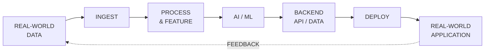

<div align="center">


<br>


<br><br>

<a href="https://github.com/Chalermsak1">
  
</a>

<a href="https://www.linkedin.com/in/chalermsak-sinsrok-b416a3365/">
  
</a>

</div>

<br>

---

## `> whoami`

<div align="center">

### Chalermsak Sinsrok

**Engineering Student · AI / ML · Data · Backend · IoT**

<br>


<br><br>

Building intelligent systems that turn  
**real-world data → useful intelligence → deployable software.**

</div>

<br>

<div align="center">

```text
DATA  →  INTELLIGENCE  →  SOFTWARE  →  REAL WORLD
```

</div>

---

## `> system.focus`

<div align="center">

<table>
<tr>

<td align="center" width="33%">

### AI / ML

`Machine Learning`  
`Computer Vision`  
`NLP`  
`Predictive Analytics`  
`Model Development`

</td>

<td align="center" width="33%">

### DATA / BACKEND

`Data Engineering`  
`Feature Engineering`  
`REST APIs`  
`PostgreSQL`  
`Backend Systems`

</td>

<td align="center" width="33%">

### SYSTEMS / IoT

`IoT`  
`Edge Systems`  
`Sensors`  
`Real-Time Systems`  
`Intelligent Applications`

</td>

</tr>
</table>

</div>

---

## `> tech --stack`

<div align="center">

### Languages


<br><br>

### Backend / Data


<br><br>

### Frontend / Systems


</div>

---

## `> ls ./projects`

<table>
<tr>

<td width="50%" valign="top">

### `01` FloodTrace

**Flood & Environmental Intelligence**

A geospatial platform focused on flood conditions,
real-world data, environmental context, and
evidence-driven analysis.

<br>

`FastAPI` `PostgreSQL` `React` `TypeScript`

<br><br>

<a href="https://github.com/Chalermsak1/FloodTrace">
  <strong>OPEN PROJECT →</strong>
</a>

</td>

<td width="50%" valign="top">

### `02` Nexvia Aegis

**AI / Security Engineering**

An engineering project exploring intelligent
software systems, automation, and
defensive security technologies.

<br>

`Python` `AI` `Security` `Automation`

<br><br>

<a href="https://github.com/Chalermsak1/nexvia-aegis">
  <strong>OPEN PROJECT →</strong>
</a>

</td>

</tr>

<tr>

<td width="50%" valign="top">

### `03` KMITL Flood Intelligence

**Real-Time Flood Intelligence**

A system combining incident reports,
geospatial information, backend services,
and real-time data delivery.

<br>

`FastAPI` `PostgreSQL` `Next.js` `SSE`

<br><br>

<a href="https://github.com/Chalermsak1/KMITL-Flood-Intelligence">
  <strong>OPEN PROJECT →</strong>
</a>

</td>

<td width="50%" valign="top">

### `04` DeepLog HDFS Anomaly Detection

**Distributed Log Anomaly Detection**

A machine-learning project focused on identifying
abnormal patterns in distributed-system logs.

<br>

`Python` `Machine Learning` `Log Analysis`

<br><br>

<a href="https://github.com/Chalermsak1/DeepLog-HDFS-Anomaly-Detection">
  <strong>OPEN PROJECT →</strong>
</a>

</td>

</tr>
</table>

---

## `> engineering.pipeline`

<div align="center">



<br>

`Collect` → `Process` → `Learn` → `Serve` → `Deploy` → `Improve`

</div>

---

## `> achievements`

<div align="center">

<table>
<tr>

<td width="50%" valign="top">

### SUPER AI ENGINEER S5

**Engineer Track**

Selected from a large applicant pool
for an AI engineering program.

`AI Engineering`

</td>

<td width="50%" valign="top">

### RE CONNECT CAI CAMP 2025

**3rd Place**

Built an AI-driven customer analytics
and personalization solution.

`LSTM` `GRU` `Attention`

</td>

</tr>

<tr>

<td width="50%" valign="top">

### BDI Young Innovator Hackathon 2026

Built a complaint intelligence
and dashboard system using NLP
and machine learning.

`TF-IDF` `Logistic Regression` `FastAPI`

</td>

<td width="50%" valign="top">

### Other Highlights

**Krungsri UniVerse × KMITL**  
Popular Vote Award

**Plant Health ML**  
Honorable Mention

**BabyVoice CNN**  
Best Project

</td>

</tr>
</table>

</div>

---

## `> github --stats`

<div align="center">


<br><br>


</div>

---

## `> contribution --visualize`

<div align="center">

<picture>

  <source
    media="(prefers-color-scheme: dark)"
    srcset="profile/github-snake-dark.svg"
  />

  <source
    media="(prefers-color-scheme: light)"
    srcset="profile/github-snake.svg"
  />

  

</picture>

</div>

---

## `> current.direction`

<div align="center">

### BUILDING ACROSS THE STACK

<br>

`AI / ML`
&nbsp;&nbsp;→&nbsp;&nbsp;
`DATA`
&nbsp;&nbsp;→&nbsp;&nbsp;
`BACKEND`
&nbsp;&nbsp;→&nbsp;&nbsp;
`SYSTEMS`

<br><br>

**AI / ML**

`Machine Learning` · `Computer Vision` · `NLP`

<br>

**DATA**

`Data Pipelines` · `Feature Engineering` · `Analytics`

<br>

**BACKEND**

`APIs` · `PostgreSQL` · `Deployment`

<br>

**SYSTEMS**

`IoT` · `Edge` · `Real-Time`

</div>

---

## `> build.philosophy`

<div align="center">

<table>
<tr>

<td align="center" width="25%">

### 01

**DATA**

Understand the signal.

</td>

<td align="center" width="25%">

### 02

**MODEL**

Turn information into intelligence.

</td>

<td align="center" width="25%">

### 03

**SYSTEM**

Connect models to software.

</td>

<td align="center" width="25%">

### 04

**IMPACT**

Put it into the real world.

</td>

</tr>
</table>

</div>

---

## `> connect`

<div align="center">

<a href="https://github.com/Chalermsak1">
  
</a>

<a href="https://www.linkedin.com/in/chalermsak-sinsrok-b416a3365/">
  
</a>

<br><br>

`AI / ML` &nbsp; `DATA` &nbsp; `BACKEND` &nbsp; `IoT`

<br><br>

**Open to building interesting systems.**

<br><br>

```text
BUILD SOMETHING USEFUL.
```

</div>

<br>

<div align="center">


</div>