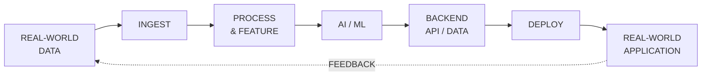

<!-- =========================================================
     HERO
========================================================= -->

<div align="center">


<br>


<br><br>

<a href="https://github.com/Chalermsak1">
  
</a>

<a href="https://www.linkedin.com/in/chalermsak-sinsrok-b416a3365/">
  
</a>

</div>

<br>

<!-- =========================================================
     IDENTITY
========================================================= -->

## `> whoami`

<table>
<tr>
<td width="58%" valign="top">

### Chalermsak Sinsrok

Engineering student interested in building systems that connect:

```text
DATA
  ↓
INTELLIGENCE
  ↓
SOFTWARE
  ↓
REAL WORLD
```

I enjoy working across the development process —
from **data preparation and machine learning**
to **backend systems, APIs, deployment, and IoT**.

</td>

<td width="42%" valign="top">

```text
┌──────────────────────────────┐
│          SYSTEM              │
├──────────────────────────────┤
│ Role       Engineering      │
│ Focus      AI / ML           │
│            Data              │
│            Backend           │
│            IoT               │
│                              │
│ Mindset    Build             │
│            Test              │
│            Deploy            │
│            Iterate           │
└──────────────────────────────┘
```

</td>
</tr>
</table>

---

<!-- =========================================================
     FOCUS
========================================================= -->

## `> system.focus`

<table>
<tr>

<td width="33%" align="center" valign="top">

### AI / ML

<br>

**Machine Learning**

**Computer Vision**

**NLP**

**Predictive Analytics**

**Model Development**

</td>

<td width="33%" align="center" valign="top">

### DATA / BACKEND

<br>

**Data Engineering**

**Feature Engineering**

**REST APIs**

**PostgreSQL**

**Backend Systems**

</td>

<td width="33%" align="center" valign="top">

### SYSTEMS / IoT

<br>

**IoT**

**Edge Systems**

**Sensors**

**Real-Time Systems**

**Intelligent Applications**

</td>

</tr>
</table>

---

<!-- =========================================================
     TECH STACK
========================================================= -->

## `> tech --stack`

### Languages

<p align="center">
  
</p>

### Backend / Data

<p align="center">
  
</p>

### Frontend / Systems

<p align="center">
  
</p>

---

<!-- =========================================================
     SELECTED PROJECTS
========================================================= -->

## `> ls ./projects`

<table>
<tr>

<td width="50%" valign="top">

### `01` — FloodTrace

**Flood & Environmental Intelligence**

A geospatial platform focused on flood conditions,
real-world data, environmental context, and
evidence-driven analysis.

```text
FastAPI
PostgreSQL
React
TypeScript
Geospatial Data
```

<a href="https://github.com/Chalermsak1/FloodTrace">
  <strong>OPEN PROJECT →</strong>
</a>

</td>

<td width="50%" valign="top">

### `02` — Nexvia Aegis

**AI / Security Engineering**

An engineering project exploring intelligent
software systems, security concepts, automation,
and defensive technologies.

```text
Python
AI
Security
Automation
```

<a href="https://github.com/Chalermsak1/nexvia-aegis">
  <strong>OPEN PROJECT →</strong>
</a>

</td>

</tr>

<tr>

<td width="50%" valign="top">

### `03` — KMITL Flood Intelligence

**Real-Time Flood Intelligence**

A system combining incident reports,
geospatial information, backend services,
and real-time data delivery.

```text
FastAPI
PostgreSQL
Next.js
SSE
Geospatial
```

<a href="https://github.com/Chalermsak1/KMITL-Flood-Intelligence">
  <strong>OPEN PROJECT →</strong>
</a>

</td>

<td width="50%" valign="top">

### `04` — DeepLog HDFS Anomaly Detection

**Distributed Log Anomaly Detection**

A machine-learning project focused on detecting
abnormal patterns in distributed-system logs.

```text
Python
Machine Learning
Log Analysis
Data
```

<a href="https://github.com/Chalermsak1/DeepLog-HDFS-Anomaly-Detection">
  <strong>OPEN PROJECT →</strong>
</a>

</td>

</tr>
</table>

---

<!-- =========================================================
     ARCHITECTURE
========================================================= -->

## `> architecture.pipeline`



<p align="center">

```text
Collect → Understand → Predict → Serve → Deploy → Learn
```

</p>

---

<!-- =========================================================
     ACHIEVEMENTS
========================================================= -->

## `> achievements`

<table>
<tr>

<td width="50%" valign="top">

### SUPER AI ENGINEER S5

Selected for the **Engineer Track**
from a large applicant pool.

```text
Track : AI Engineering
Focus : AI / ML
```

</td>

<td width="50%" valign="top">

### RE CONNECT CAI CAMP 2025

**3rd Place**

Built an AI-driven customer analytics
and personalization solution.

```text
LSTM / GRU
Attention
Customer Analytics
```

</td>

</tr>

<tr>

<td width="50%" valign="top">

### BDI Young Innovator Hackathon 2026

Worked on a complaint intelligence
and data-driven dashboard.

```text
NLP
TF-IDF
Logistic Regression
FastAPI
```

</td>

<td width="50%" valign="top">

### Other Highlights

```text
Krungsri UniVerse x KMITL
Popular Vote Award

Plant Health ML
Honorable Mention

BabyVoice CNN
Best Project
```

</td>

</tr>
</table>

---

<!-- =========================================================
     GITHUB STATS
========================================================= -->

## `> github --stats`

<p align="center">


</p>

<p align="center">


</p>

---

<!-- =========================================================
     CONTRIBUTION
========================================================= -->

## `> contribution --visualize`

<div align="center">

<picture>

  <source
    media="(prefers-color-scheme: dark)"
    srcset="profile/github-snake-dark.svg"
  />

  <source
    media="(prefers-color-scheme: light)"
    srcset="profile/github-snake.svg"
  />

  

</picture>

</div>

---

<!-- =========================================================
     BUILD PHILOSOPHY
========================================================= -->

## `> build.philosophy`

<table>
<tr>

<td width="25%" align="center">

### 01

**DATA**

Understand the signal before
building the system.

</td>

<td width="25%" align="center">

### 02

**MODEL**

Turn information into
useful intelligence.

</td>

<td width="25%" align="center">

### 03

**SYSTEM**

Connect models to reliable
software and APIs.

</td>

<td width="25%" align="center">

### 04

**IMPACT**

Deploy ideas into
real-world use.

</td>

</tr>
</table>

---

<!-- =========================================================
     CURRENT DIRECTION
========================================================= -->

## `> current.direction`

```text
AI ENGINEERING
      │
      ├── Machine Learning
      ├── Computer Vision
      └── Intelligent Systems

DATA ENGINEERING
      │
      ├── Data Pipelines
      ├── Feature Engineering
      └── Analytics

BACKEND ENGINEERING
      │
      ├── APIs
      ├── PostgreSQL
      └── Deployment

IoT / SYSTEMS
      │
      ├── Sensors
      ├── Edge Systems
      └── Real-World Applications
```

---

<!-- =========================================================
     FOOTER / CONTACT
========================================================= -->

<div align="center">

## `> connect`

<a href="https://github.com/Chalermsak1">
  
</a>

<a href="https://www.linkedin.com/in/chalermsak-sinsrok-b416a3365/">
  
</a>

<br><br>

```text
BUILD SOMETHING USEFUL.
```

<br>


</div>